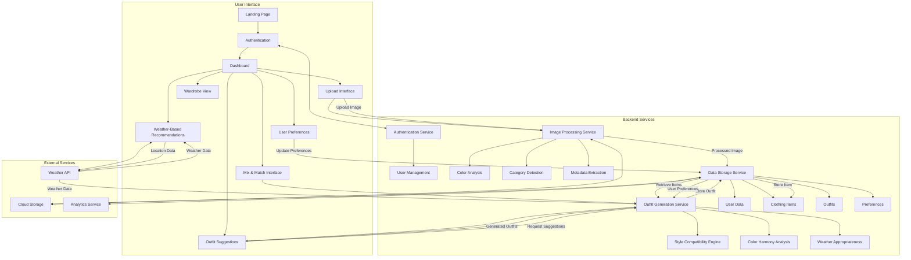
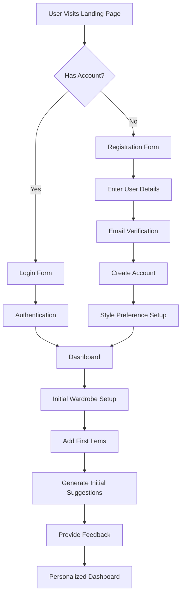
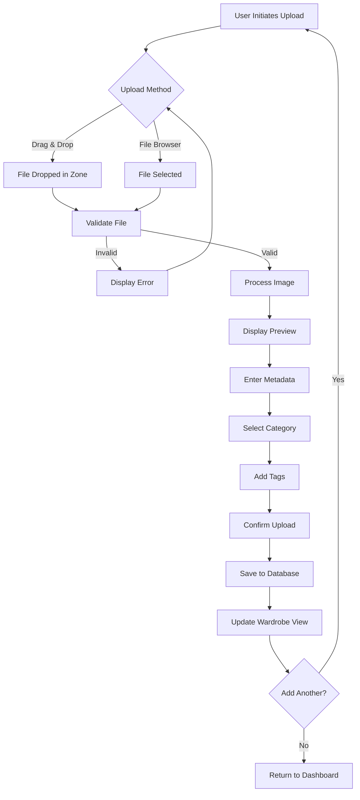
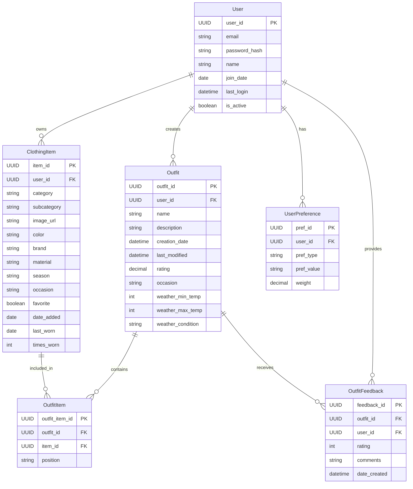
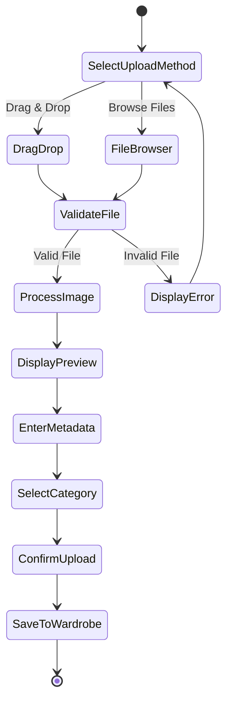
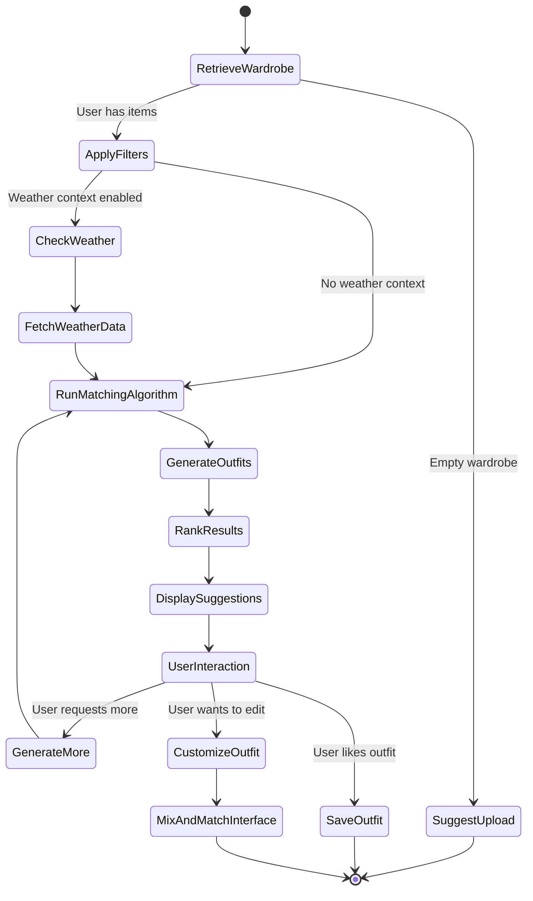
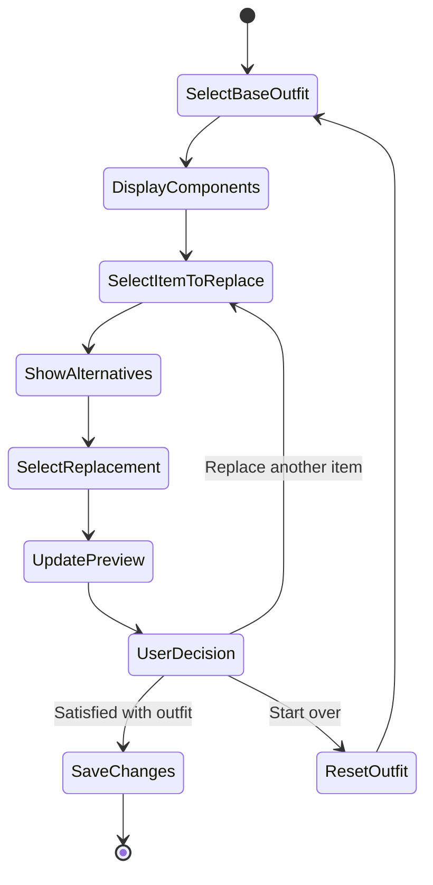
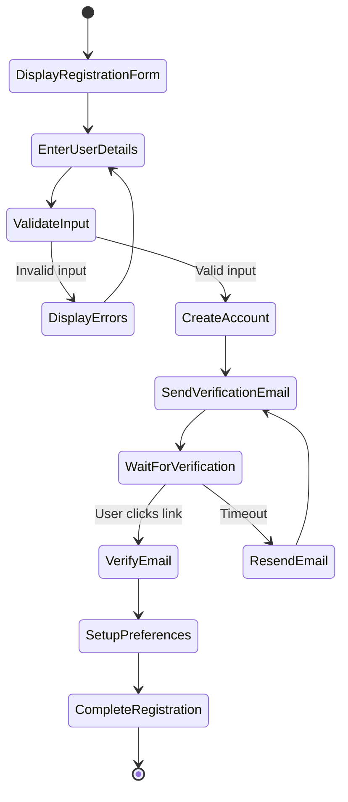

# OutfitMatch Pro - AI-Powered Wardrobe Assistant

## Table of Contents

1. [Introduction](#1-introduction)
2. [System Study](#2-system-study)
   - [Existing System](#existing-system)
   - [Scope](#scope)
   - [Module Description](#module-description)
3. [Feasibility Study](#3-feasibility-study)
   - [Technical Feasibility](#technical-feasibility)
   - [Operational Feasibility](#operational-feasibility)
   - [Economic Feasibility](#economic-feasibility)
   - [Behavioral Feasibility](#behavioral-feasibility)
4. [Software Requirement Specification](#4-software-requirement-specification)
   - [Purpose](#purpose)
   - [External Interface Requirement](#external-interface-requirement)
   - [Functional Requirement](#functional-requirement)
   - [Non-Functional Requirement](#non-functional-requirement)
   - [System Specification](#system-specification)
   - [Python Libraries](#python-libraries)
   - [Jupyter Notebook](#jupyter-notebook)
   - [PyCharm](#pycharm)
5. [System Design](#5-system-design)
   - [Input Design](#input-design)
   - [Output Design](#output-design)
   - [Workflow of Proposed System](#workflow-of-proposed-system)
   - [Workflow of System](#workflow-of-system)
   - [AI Powered Chatbot](#ai-powered-chatbot)
   - [Database](#database)
   - [UML Activity Diagram](#uml-activity-diagram)
6. [System Implementation and Maintenance](#6-system-implementation-and-maintenance)
   - [Technical Specifications](#technical-specifications)
7. [AI Description](#7-ai-description)
   - [Chatbot Description](#chatbot-description)
8. [System Testing](#8-system-testing)
   - [Different Levels of Testing](#different-levels-of-testing)
9. [Future Enhancement](#9-future-enhancement)
10. [Conclusion](#10-conclusion)
11. [Bibliography](#11-bibliography)
12. [Sample Screenshot](#12-sample-screenshot)
13. [Source Code](#13-source-code)

## 1. Introduction

OutfitMatch Pro is a comprehensive web application designed to transform the way users organize, visualize, and coordinate their wardrobes. The application leverages artificial intelligence and modern web technologies to provide a seamless and intuitive experience for digitizing clothing collections and receiving personalized outfit recommendations.

In today's fast-paced world, many individuals face the daily challenge of selecting appropriate outfits from their existing wardrobe. Despite having numerous clothing items, the lack of organization and visualization often leads to the common problem of "having nothing to wear." OutfitMatch Pro addresses this challenge by creating a digital representation of the user's wardrobe and applying sophisticated matching algorithms to suggest optimal outfit combinations.

The application's primary objectives include:

- Simplifying wardrobe organization through digital cataloging
- Reducing decision fatigue through AI-powered outfit suggestions
- Maximizing the utility of existing clothing collections
- Providing contextual recommendations based on weather and occasions
- Offering an interactive mix-and-match interface for custom outfit creation

By combining cutting-edge technology with principles of fashion and style, OutfitMatch Pro aims to enhance the user's relationship with their wardrobe, promote sustainable fashion practices, and streamline the daily outfit selection process.

## 2. System Study

### Existing System

Traditional wardrobe management typically relies on physical organization methods and manual outfit planning. Users organize clothing in closets, drawers, and storage containers, often categorized by type, season, or frequency of use. Outfit planning is predominantly a manual process based on personal experience, fashion knowledge, and trial-and-error.

Existing digital solutions in this space present several limitations:

1. **Basic Inventory Apps**: Simple applications that allow users to catalog items but lack intelligent matching capabilities.

2. **Fashion Recommendation Platforms**: Services that focus on suggesting new purchases rather than optimizing existing wardrobes.

3. **Social Fashion Networks**: Platforms for sharing outfit ideas but without personalized recommendations based on the user's actual wardrobe.

4. **E-commerce Styling Tools**: Virtual try-on solutions tied to specific retailers, prioritizing sales over wardrobe optimization.

Limitations of existing systems include:

- Lack of comprehensive digital wardrobe representation
- Absence of intelligent outfit matching algorithms
- Poor user experience and complex interfaces
- Limited or no integration with contextual factors like weather
- Focus on consumption rather than optimization of existing items
- Minimal personalization based on user preferences and style
- No capability for tracking outfit history and preferences

### Scope

OutfitMatch Pro encompasses the following scope:

1. **User Management**:
   - Account creation and authentication
   - Profile customization
   - Preference settings
   - Style profile development

2. **Wardrobe Digitization**:
   - Image upload and processing
   - Automatic and manual categorization
   - Metadata tagging and organization
   - Search and filtering capabilities

3. **Outfit Generation**:
   - AI-based suggestion algorithms
   - Style rule implementation
   - Color theory application
   - Contextual adaptation

4. **Interactive Styling**:
   - Mix and match interface
   - Custom outfit creation
   - Outfit saving and naming
   - Rating and feedback system

5. **Weather Integration**:
   - Location-based weather data
   - Temperature-appropriate suggestions
   - Condition-specific recommendations

6. **Mobile Responsiveness**:
   - Cross-device compatibility
   - Responsive design principles
   - Touch-friendly interface

### Module Description

OutfitMatch Pro is structured into the following key modules:

1. **Authentication Module**:
   - Handles user registration and login
   - Manages session persistence
   - Provides password recovery functionality
   - Ensures secure access to user data

2. **Upload Module**:
   - Facilitates clothing item image upload
   - Provides drag-and-drop and file browser interfaces
   - Implements image validation and processing
   - Guides users through the categorization process
   - Collects and stores item metadata

3. **Wardrobe Module**:
   - Displays the complete digital wardrobe
   - Implements advanced filtering and search
   - Provides category-based organization
   - Enables item management (edit, delete, favorite)
   - Visualizes wardrobe statistics and insights

4. **Outfit Suggestion Module**:
   - Generates AI-powered outfit combinations
   - Applies style rules and color theory
   - Adapts to user preferences and feedback
   - Presents suggestions in an appealing visual format
   - Allows for saving and rating outfits

5. **Mix & Match Module**:
   - Provides an interactive outfit customization interface
   - Enables component-by-component outfit building
   - Offers alternative suggestions for each component
   - Visualizes the complete outfit in real-time
   - Implements undo/redo functionality for experimentation

6. **Weather Integration Module**:
   - Connects to weather data APIs
   - Processes location and forecast information
   - Adapts outfit suggestions to weather conditions
   - Provides temperature and condition-appropriate recommendations
   - Allows for manual weather scenario testing

7. **User Preference Module**:
   - Captures style preferences and fashion tastes
   - Tracks user interactions and feedback
   - Builds a personalized style profile
   - Adapts recommendations based on learned preferences
   - Provides preference management interface

## 3. Feasibility Study

### Technical Feasibility

The technical feasibility of OutfitMatch Pro is evaluated based on the availability and maturity of required technologies, development expertise, and technical infrastructure.

#### Technology Stack Assessment

1. **Frontend Technologies**:
   - React.js with TypeScript: Mature framework with strong typing for robust UI development
   - Tailwind CSS: Utility-first CSS framework for responsive design
   - Shadcn UI: Component library for consistent and accessible interface elements
   - Framer Motion: Animation library for smooth transitions and interactions

2. **Backend Technologies**:
   - Django REST Framework: Established Python framework for API development
   - PostgreSQL: Reliable relational database for structured data storage
   - JWT Authentication: Secure token-based authentication mechanism
   - Pillow: Python imaging library for image processing

3. **AI and Machine Learning**:
   - Color analysis algorithms: Extracting and analyzing dominant colors from images
   - Style compatibility rules: Implementing fashion principles in code
   - Recommendation systems: Collaborative and content-based filtering techniques
   - Preference learning: Adapting to user feedback over time

4. **Infrastructure**:
   - Docker containerization: Consistent deployment across environments
   - Cloud hosting: Scalable infrastructure for application components
   - CDN integration: Fast delivery of static assets and images
   - CI/CD pipelines: Automated testing and deployment

#### Technical Risks and Mitigations

1. **Image Processing Challenges**:
   - Risk: Inconsistent image quality affecting analysis
   - Mitigation: Implement image normalization and preprocessing techniques

2. **Algorithm Complexity**:
   - Risk: Complex matching algorithms impacting performance
   - Mitigation: Optimize algorithms and implement caching strategies

3. **Data Volume**:
   - Risk: Large image datasets requiring significant storage
   - Mitigation: Implement image compression and tiered storage solutions

4. **Integration Complexity**:
   - Risk: Challenges in integrating multiple services
   - Mitigation: Use well-defined APIs and implement robust error handling

### Operational Feasibility

Operational feasibility assesses how well OutfitMatch Pro will work in the target environment and how users will interact with the system.

#### User Experience Considerations

1. **Intuitive Interface**:
   - Clear navigation and workflow
   - Consistent design patterns
   - Progressive disclosure of complex features
   - Helpful onboarding and guidance

2. **Accessibility**:
   - WCAG 2.1 compliance for key features
   - Screen reader compatibility
   - Keyboard navigation support
   - Color contrast considerations

3. **Performance**:
   - Fast page load times (<2 seconds)
   - Responsive interactions
   - Efficient image loading strategies
   - Background processing for intensive operations

4. **Error Handling**:
   - Clear error messages
   - Graceful degradation
   - Recovery options
   - Data preservation during failures

#### Operational Requirements

1. **Maintenance Procedures**:
   - Regular updates and feature enhancements
   - Security patches and vulnerability management
   - Database optimization and cleanup
   - Performance monitoring and tuning

2. **Support Infrastructure**:
   - User documentation and help resources
   - Feedback collection mechanisms
   - Issue reporting and tracking
   - Response protocols for critical issues

3. **Training Requirements**:
   - Minimal training needed due to intuitive design
   - In-app tutorials and tooltips
   - Contextual help for complex features
   - Video guides for key workflows

### Economic Feasibility

Economic feasibility evaluates the cost-benefit relationship of developing and maintaining OutfitMatch Pro.

#### Development Costs

1. **Initial Development**:
   - Frontend development: 400 hours
   - Backend development: 350 hours
   - AI algorithm development: 200 hours
   - UI/UX design: 150 hours
   - Testing and quality assurance: 200 hours

2. **Infrastructure**:
   - Cloud hosting services
   - Database services
   - Storage services
   - CDN services
   - Development and staging environments

3. **Third-party Services**:
   - Weather API subscription
   - Analytics services
   - Monitoring tools
   - Authentication services

#### Operational Costs

1. **Ongoing Maintenance**:
   - Bug fixes and updates
   - Security patches
   - Feature enhancements
   - Performance optimization

2. **Infrastructure Scaling**:
   - Increased storage for growing user base
   - Additional computing resources
   - Bandwidth expansion

3. **Support**:
   - User support resources
   - Documentation updates
   - Community management

#### Revenue Potential

1. **Freemium Model**:
   - Basic features free for all users
   - Premium features available through subscription
   - Tiered pricing based on wardrobe size and features

2. **Partnership Opportunities**:
   - Fashion retailer integrations
   - Affiliate marketing for complementary items
   - Sponsored content and recommendations

3. **Data Insights**:
   - Anonymized trend analysis for fashion industry
   - Aggregated preference data
   - Market research capabilities

### Behavioral Feasibility

Behavioral feasibility assesses how well OutfitMatch Pro aligns with user behaviors, preferences, and psychological factors that influence adoption and continued use.

#### User Motivation Analysis

1. **Pain Points Addressed**:
   - Reduces decision fatigue in daily outfit selection
   - Eliminates the "nothing to wear" syndrome despite a full closet
   - Provides confidence in style choices
   - Maximizes wardrobe investment

2. **Psychological Factors**:
   - Satisfies desire for organization and control
   - Provides positive reinforcement through successful outfit creation
   - Reduces anxiety associated with clothing decisions
   - Creates a sense of accomplishment through wardrobe mastery

3. **Habit Formation**:
   - Daily outfit planning creates regular engagement
   - Wardrobe building becomes an ongoing activity
   - Rating system encourages feedback and improvement
   - Weather integration promotes contextual checking

#### Adoption Strategies

1. **Onboarding Experience**:
   - Quick value demonstration with minimal initial input
   - Gradual complexity introduction
   - Early wins through simple outfit suggestions
   - Clear progress indicators for wardrobe building

2. **Engagement Mechanics**:
   - Gamification elements for wardrobe completion
   - Achievement system for style milestones
   - Social sharing capabilities for outfit creations
   - Regular fresh content through seasonal suggestions

## 4. Software Requirement Specification

### Purpose

The purpose of OutfitMatch Pro is to provide users with a comprehensive digital solution for wardrobe management and outfit coordination. The application aims to solve the common problem of inefficient wardrobe utilization and outfit decision fatigue through intelligent organization, visualization, and recommendation capabilities.

Specific objectives include:

1. **Wardrobe Digitization**: Enable users to create a complete digital representation of their physical wardrobe through an intuitive upload and categorization process.

2. **Intelligent Organization**: Provide a structured system for categorizing, tagging, and searching clothing items based on various attributes such as type, color, style, occasion, and season.

3. **Outfit Generation**: Leverage AI algorithms to generate personalized outfit suggestions based on style rules, color theory, user preferences, and contextual factors.

4. **Interactive Styling**: Offer an intuitive mix-and-match interface for users to create, customize, and visualize outfits before physical try-on.

5. **Contextual Recommendations**: Incorporate external factors such as weather conditions, occasions, and seasonal trends into the outfit suggestion process.

6. **Style Learning**: Develop a system that learns from user interactions, ratings, and feedback to continuously improve the relevance and quality of outfit recommendations.

7. **Wardrobe Insights**: Provide analytics and insights on wardrobe composition, utilization patterns, and style preferences to help users make informed decisions.

### External Interface Requirement

#### User Interfaces

1. **Landing Page**:
   - Hero section with value proposition
   - Feature showcase with visual examples
   - Call-to-action for registration/login
   - Responsive design for all device sizes

2. **Authentication Interfaces**:
   - Registration form with email verification
   - Login form with password recovery
   - Social authentication options
   - Profile setup wizard

3. **Upload Interface**:
   - Drag-and-drop zone for image upload
   - File browser alternative
   - Upload progress indication
   - Image preview and editing tools
   - Categorization form with guided steps

4. **Wardrobe View**:
   - Grid layout of clothing items
   - Category-based tabs and filters
   - Search functionality with auto-suggestions
   - Item cards with quick actions
   - Sorting options (recent, favorite, color, etc.)

5. **Outfit Suggestion Interface**:
   - Visual display of generated outfits
   - Filtering options for occasions and styles
   - Rating and feedback mechanisms
   - Save and share capabilities
   - Refresh and regenerate options

#### Hardware Interfaces

1. **Camera Access**:
   - Mobile device camera integration for direct capture
   - Image quality optimization for various camera capabilities
   - Flash control for consistent lighting

2. **Touch Screen Optimization**:
   - Touch-friendly controls and gestures
   - Drag-and-drop support for touch devices
   - Pinch-to-zoom for image details
   - Swipe navigation for outfit browsing

#### Software Interfaces

1. **Weather API Integration**:
   - RESTful API communication
   - Location-based data retrieval
   - Current conditions and forecast data
   - Error handling for service unavailability

2. **Cloud Storage Integration**:
   - Secure file upload and retrieval
   - Image optimization and processing
   - CDN distribution for performance
   - Backup and redundancy mechanisms

3. **Authentication Services**:
   - OAuth 2.0 integration for social login
   - JWT token management
   - Session handling and security

### Functional Requirement

#### User Management

1. **Registration and Authentication**:
   - FR-1.1: The system shall allow users to register with email and password
   - FR-1.2: The system shall provide email verification for new accounts
   - FR-1.3: The system shall support password recovery via email
   - FR-1.4: The system shall allow social media authentication options
   - FR-1.5: The system shall maintain secure user sessions

2. **Profile Management**:
   - FR-2.1: The system shall allow users to create and edit profile information
   - FR-2.2: The system shall support profile picture upload and management
   - FR-2.3: The system shall enable users to set and update style preferences
   - FR-2.4: The system shall provide privacy settings for user data
   - FR-2.5: The system shall allow account deactivation and deletion

#### Wardrobe Management

3. **Item Upload**:
   - FR-3.1: The system shall provide multiple methods for image upload (drag-drop, file browser)
   - FR-3.2: The system shall validate uploaded images for format and size
   - FR-3.3: The system shall process and optimize uploaded images
   - FR-3.4: The system shall display a preview of uploaded images
   - FR-3.5: The system shall support batch uploading of multiple items

4. **Item Categorization**:
   - FR-4.1: The system shall guide users through a categorization process
   - FR-4.2: The system shall support primary categories (tops, bottoms, shoes, accessories)
   - FR-4.3: The system shall allow subcategory assignment (t-shirts, blouses, jeans, etc.)
   - FR-4.4: The system shall enable tagging items with multiple attributes
   - FR-4.5: The system shall support custom category creation

#### Outfit Generation

5. **AI Suggestions**:
   - FR-5.1: The system shall generate outfit combinations based on style rules
   - FR-5.2: The system shall apply color harmony principles to suggestions
   - FR-5.3: The system shall consider user preferences in generating outfits
   - FR-5.4: The system shall adapt suggestions based on feedback and ratings
   - FR-5.5: The system shall provide diversity in suggestions

6. **Contextual Adaptation**:
   - FR-6.1: The system shall incorporate weather data into outfit suggestions
   - FR-6.2: The system shall support occasion-based filtering (casual, formal, etc.)
   - FR-6.3: The system shall consider seasonal appropriateness
   - FR-6.4: The system shall allow manual context specification
   - FR-6.5: The system shall adapt to location-specific factors

### Non-Functional Requirement

#### Performance

1. **Response Time**:
   - NFR-1.1: The system shall load the main interface within 2 seconds on standard connections
   - NFR-1.2: The system shall process image uploads within 5 seconds
   - NFR-1.3: The system shall generate outfit suggestions within 3 seconds
   - NFR-1.4: The system shall respond to user interactions within 300ms

2. **Scalability**:
   - NFR-2.1: The system shall support at least 10,000 concurrent users
   - NFR-2.2: The system shall handle wardrobes of up to 1,000 items per user
   - NFR-2.3: The system shall maintain performance with growing data volume
   - NFR-2.4: The system shall implement caching strategies for frequent operations

#### Security

3. **Data Protection**:
   - NFR-3.1: The system shall encrypt all user data in transit using TLS
   - NFR-3.2: The system shall store passwords using strong hashing algorithms
   - NFR-3.3: The system shall implement secure token-based authentication
   - NFR-3.4: The system shall protect against common web vulnerabilities (XSS, CSRF, etc.)

4. **Privacy**:
   - NFR-4.1: The system shall comply with GDPR requirements
   - NFR-4.2: The system shall provide clear privacy policies
   - NFR-4.3: The system shall allow users to export and delete their data
   - NFR-4.4: The system shall implement data minimization principles

#### Reliability

5. **Availability**:
   - NFR-5.1: The system shall maintain 99.9% uptime
   - NFR-5.2: The system shall implement redundancy for critical components
   - NFR-5.3: The system shall handle graceful degradation during partial outages
   - NFR-5.4: The system shall provide status updates during maintenance

### System Specification

#### Frontend Architecture

1. **Technology Stack**:
   - React.js with TypeScript for component-based UI development
   - Redux for state management
   - React Router for navigation
   - Tailwind CSS for styling
   - Shadcn UI for component library
   - Framer Motion for animations
   - React Hook Form for form handling
   - Zod for validation

2. **Component Structure**:
   - Atomic design methodology
   - Reusable UI components
   - Container/presenter pattern
   - Context providers for shared state
   - Custom hooks for business logic

#### Backend Architecture

1. **Technology Stack**:
   - Django REST Framework for API development
   - PostgreSQL for relational data storage
   - Redis for caching and session management
   - Celery for asynchronous task processing
   - JWT for authentication
   - Nginx for web serving and reverse proxy

2. **API Design**:
   - RESTful principles
   - Resource-oriented endpoints
   - Versioned API
   - Comprehensive documentation
   - Rate limiting and throttling

### Python Libraries

The backend implementation of OutfitMatch Pro utilizes several Python libraries to provide robust functionality:

1. **Django (4.2.x)**:
   - Web framework for backend development
   - URL routing and view handling
   - ORM for database interactions
   - Admin interface for data management
   - Security features and middleware

2. **Django REST Framework (3.14.x)**:
   - API development framework
   - Serialization and deserialization
   - Authentication and permissions
   - Viewsets and routers
   - Filtering and pagination

3. **Pillow (10.2.x)**:
   - Image processing library
   - Format conversion and validation
   - Resizing and optimization
   - Color analysis
   - Metadata extraction

4. **NumPy (1.24.x)**:
   - Numerical computing library
   - Array operations for image data
   - Mathematical functions
   - Random number generation
   - Statistical operations

5. **Pandas (2.0.x)**:
   - Data manipulation and analysis
   - DataFrame operations
   - Data filtering and transformation
   - Statistical analysis
   - CSV and JSON handling

6. **scikit-learn (1.2.x)**:
   - Machine learning library
   - Clustering algorithms
   - Classification models
   - Feature extraction
   - Model persistence

### Jupyter Notebook

Jupyter Notebooks are used during development for:
- Prototyping machine learning models
- Data analysis and visualization
- Testing image processing algorithms
- Documenting research findings
- Collaborative development of AI components

Key benefits of using Jupyter Notebooks in the development process:
- Interactive code execution and visualization
- Rich documentation with markdown support
- Easy sharing of research findings
- Reproducible experiments
- Integration with data science libraries

### PyCharm

PyCharm IDE is used for backend development with benefits including:
- Integrated debugging
- Django-specific tools and templates
- Database tools
- Version control integration
- Code quality tools
- Refactoring capabilities
- Test runner integration
- Deployment tools

## 5. System Design

### Input Design

The input design for OutfitMatch Pro focuses on creating intuitive, efficient, and error-resistant methods for users to provide data to the system. The primary input interfaces are designed with user experience and data quality as priorities.

#### Clothing Item Upload

1. **Drag and Drop Interface**:
   - Visual drop zone with clear instructions
   - Animated feedback during drag operations
   - File type validation with visual indicators
   - Progress indication during upload
   - Error handling with actionable messages

2. **File Browser Alternative**:
   - Standard file selection dialog
   - Multiple file selection support
   - Thumbnail preview before confirmation
   - Format and size validation
   - Retry options for failed uploads

3. **Image Processing**:
   - Automatic image optimization
   - Background removal option
   - Orientation correction
   - Thumbnail generation
   - Metadata extraction (when available)

#### Categorization Form

1. **Guided Categorization Process**:
   - Step-by-step workflow
   - Visual category selection
   - Progress indication
   - Contextual help and examples
   - Validation with error prevention

2. **Category Selection**:
   - Primary category options (tops, bottoms, shoes, accessories)
   - Subcategory refinement
   - Visual icons for quick recognition
   - Recently used categories for efficiency
   - Custom category creation

### Output Design

The output design for OutfitMatch Pro focuses on presenting information in a clear, visually appealing, and actionable manner. The system's outputs are designed to provide value and insights while maintaining usability across devices.

#### Wardrobe Visualization

1. **Grid Layout**:
   - Consistent item cards with uniform dimensions
   - Responsive grid adapting to screen size
   - Lazy loading for performance
   - Empty state handling with guidance
   - Infinite scroll with batch loading

2. **Item Cards**:
   - High-quality item image as focal point
   - Category indicator with color coding
   - Favorite status with toggle action
   - Quick action buttons on hover/focus
   - Visual feedback for selection state

3. **Wardrobe Statistics**:
   - Category distribution visualization
   - Color palette representation
   - Recent additions highlight
   - Most/least used items
   - Completeness indicators

#### Outfit Suggestions

1. **Outfit Cards**:
   - Visual composition of outfit components
   - Item breakdown with thumbnails
   - Occasion and weather suitability indicators
   - Style tags and description
   - Action buttons for save, edit, and share

2. **Suggestion Grid**:
   - Diverse outfit options in scrollable grid
   - Visual grouping by occasion or style
   - New suggestion indicators
   - Empty state with guidance
   - Refresh control for new suggestions

### Workflow of Proposed System

The workflow of OutfitMatch Pro is designed to provide a seamless user experience from initial registration through ongoing wardrobe management and outfit discovery. The system's processes are organized to minimize friction and maximize value at each step.

#### User Onboarding Flow

1. **Registration and Authentication**:
   - User discovers application through marketing channels
   - User completes registration form with email verification
   - User creates account and sets initial password
   - User logs in and is directed to onboarding

2. **Style Profile Creation**:
   - User completes style preference questionnaire
   - System captures basic style preferences and priorities
   - User indicates typical occasions and needs
   - System creates initial style profile

3. **Initial Wardrobe Setup**:
   - User is guided to add first clothing items
   - System suggests starting with frequently worn items
   - User uploads and categorizes initial set (5-10 items)
   - System provides encouragement and progress tracking

4. **First Outfit Generation**:
   - System generates initial outfit suggestions from limited wardrobe
   - User receives immediate value demonstration
   - User can rate and provide feedback on suggestions
   - System explains how additional items improve suggestions

#### Core User Workflows

1. **Wardrobe Building Workflow**:
   - User initiates item upload process
   - User selects upload method (drag-drop or file browser)
   - System processes and optimizes uploaded images
   - User categorizes items with guided form
   - User adds metadata (color, brand, occasion, etc.)
   - System confirms successful addition to wardrobe
   - User continues with batch uploads or returns to wardrobe view

2. **Outfit Discovery Workflow**:
   - User navigates to outfit suggestions section
   - User optionally sets context (weather, occasion)
   - System generates personalized outfit suggestions
   - User browses suggestions with filtering options
   - User selects outfit for detailed view
   - User rates, saves, or customizes selected outfit
   - System learns from user interactions

3. **Mix & Match Workflow**:
   - User initiates custom outfit creation
   - User selects base outfit or starts from scratch
   - System displays component selection interface
   - User selects items for each component (top, bottom, etc.)
   - System provides real-time preview and style guidance
   - User iterates until satisfied with composition
   - User saves and names the custom outfit
   - System adds to saved outfits collection

### Workflow of System



#### User Registration and Onboarding Flow



#### Clothing Item Upload Workflow



### AI Powered Chatbot

A future enhancement includes an AI-powered chatbot for:

- Style advice and recommendations
- Guided wardrobe building
- Occasion-specific outfit suggestions
- Fashion trend information
- Application usage assistance

The chatbot will utilize natural language processing to understand user queries and provide contextually relevant responses.

#### Chatbot Architecture

1. **Natural Language Understanding**:
   - Intent recognition
   - Entity extraction
   - Context management
   - Sentiment analysis

2. **Knowledge Base**:
   - Fashion rules and guidelines
   - Style compatibility information
   - Seasonal recommendations
   - Trend data
   - Application documentation

3. **Personalization Layer**:
   - User preference integration
   - Wardrobe awareness
   - Interaction history
   - Adaptive responses

4. **Conversation Flow**:
   - Greeting and introduction
   - Query understanding
   - Information retrieval
   - Response generation
   - Follow-up suggestions

#### Chatbot Integration Points

1. **User Interface**:
   - Persistent chat button
   - Expandable chat panel
   - Message history
   - Suggested queries

2. **Backend Services**:
   - Connection to outfit generation engine
   - Access to user wardrobe data
   - Integration with weather service
   - Link to user preferences

3. **Learning Mechanism**:
   - Feedback collection
   - Query pattern analysis
   - Response effectiveness tracking
   - Continuous improvement

### Database

The database design for OutfitMatch Pro is structured to efficiently store and retrieve user data, clothing items, outfits, and preferences while maintaining data integrity and supporting the application's functional requirements.

#### Entity-Relationship Diagram



#### Table Definitions

1. **User Table**:
   - Primary key: user_id (UUID)
   - Fields: email, password_hash, name, join_date, last_login, is_active
   - Indexes: email (unique), last_login
   - Relationships: One-to-many with ClothingItem, Outfit, UserPreference

2. **ClothingItem Table**:
   - Primary key: item_id (UUID)
   - Foreign key: user_id (references User)
   - Fields: category, subcategory, image_url, color, brand, material, season, occasion, favorite, date_added, last_worn, times_worn
   - Indexes: user_id, category, favorite
   - Relationships: Many-to-one with User, Many-to-many with Outfit (through OutfitItem)

3. **Outfit Table**:
   - Primary key: outfit_id (UUID)
   - Foreign key: user_id (references User)
   - Fields: name, description, creation_date, last_modified, rating, occasion, weather_min_temp, weather_max_temp, weather_condition
   - Indexes: user_id, creation_date, rating
   - Relationships: Many-to-one with User, Many-to-many with ClothingItem (through OutfitItem)

4. **OutfitItem Table** (Junction table):
   - Primary key: outfit_item_id (UUID)
   - Foreign keys: outfit_id (references Outfit), item_id (references ClothingItem)
   - Fields: position (enum: top, bottom, shoes, accessory, etc.)
   - Indexes: outfit_id, item_id
   - Relationships: Many-to-one with both Outfit and ClothingItem

5. **UserPreference Table**:
   - Primary key: pref_id (UUID)
   - Foreign key: user_id (references User)
   - Fields: pref_type (enum: style, color, pattern, etc.), pref_value, weight
   - Indexes: user_id, pref_type
   - Relationships: Many-to-one with User

6. **OutfitFeedback Table**:
   - Primary key: feedback_id (UUID)
   - Foreign keys: outfit_id (references Outfit), user_id (references User)
   - Fields: rating, comments, date_created
   - Indexes: outfit_id, user_id
   - Relationships: Many-to-one with both Outfit and User

### UML Activity Diagram

#### Clothing Item Upload Process



#### Outfit Generation Process



#### Mix & Match Process



#### User Registration Process



## 6. System Implementation and Maintenance

### Technical Specifications

#### Development Environment

1. **Frontend Development**:
   - Visual Studio Code with React extensions
   - Node.js (v18.x) runtime
   - npm package manager
   - ESLint for code quality
   - Prettier for code formatting
   - Jest and React Testing Library for unit testing
   - Storybook for component development
   - Chrome DevTools for debugging

2. **Backend Development**:
   - PyCharm Professional with Django support
   - Python 3.10+ interpreter
   - pip package manager
   - Django Debug Toolbar
   - pytest for unit testing
   - Black for code formatting
   - isort for import sorting
   - mypy for type checking

3. **Version Control**:
   - Git for source control
   - GitHub for repository hosting
   - Branch protection rules
   - Pull request workflow
   - Code review process
   - Conventional commits standard

4. **Local Environment**:
   - Docker for containerization
   - Docker Compose for multi-container setup
   - Local PostgreSQL instance
   - Redis for caching and queues
   - Mailhog for email testing
   - Nginx for local proxy

#### Deployment Architecture

1. **Infrastructure as Code**:
   - Terraform for infrastructure provisioning
   - Ansible for configuration management
   - Environment-specific configuration
   - Secret management with vault

2. **Container Orchestration**:
   - Docker images for application components
   - Kubernetes for orchestration (production)
   - Docker Compose for simpler environments
   - Helm charts for deployment templates
   - Horizontal pod autoscaling

3. **Cloud Services** (AWS example):
   - EC2 or EKS for application hosting
   - RDS for PostgreSQL database
   - ElastiCache for Redis
   - S3 for image storage
   - CloudFront for CDN
   - Route 53 for DNS management
   - Certificate Manager for SSL
   - CloudWatch for monitoring

#### CI/CD Pipeline

1. **Continuous Integration**:
   - GitHub Actions for automation
   - Automated testing on pull requests
   - Code quality checks
   - Security scanning
   - Build verification

2. **Continuous Deployment**:
   - Environment promotion workflow
   - Blue-green deployment strategy
   - Automated rollback capability
   - Deployment approval gates
   - Post-deployment verification

#### Monitoring and Observability

1. **Application Monitoring**:
   - New Relic or Datadog for APM
   - Request tracing
   - Error tracking with Sentry
   - Performance metrics
   - Custom business metrics

2. **Infrastructure Monitoring**:
   - Resource utilization tracking
   - Capacity planning metrics
   - Alert thresholds and notifications
   - Automated scaling triggers
   - Cost optimization insights

## 7. AI Description

### Chatbot Description

The AI-powered outfit suggestion engine uses a combination of techniques:

1. **Color Harmony Analysis**:
   - Extracts dominant colors from clothing items
   - Applies color theory principles (complementary, analogous, etc.)
   - Considers user color preferences
   - Evaluates seasonal color appropriateness
   - Generates harmony scores for combinations

2. **Style Compatibility**:
   - Categorizes items by style (casual, formal, sporty, etc.)
   - Matches compatible styles based on fashion rules
   - Learns from user selections and ratings
   - Adapts to personal style preferences
   - Considers occasion appropriateness

3. **Contextual Awareness**:
   - Incorporates weather data for appropriate suggestions
   - Considers occasions (work, casual, formal)
   - Adapts to seasonal trends
   - Accounts for time of day
   - Factors in location-specific considerations

4. **Personalization**:
   - Builds user preference profile
   - Weighs suggestions based on past behavior
   - Balances between familiar combinations and novel suggestions
   - Adapts to feedback and ratings
   - Considers frequency of wear and favorites

The algorithm improves over time through machine learning techniques applied to user interaction data, creating increasingly personalized and relevant outfit suggestions.

## 8. System Testing

### Different Levels of Testing

1. **Unit Testing**:
   - Frontend component tests with React Testing Library
   - Backend API tests with Django Test Framework
   - Database model tests
   - Utility function tests
   - Isolated algorithm tests

2. **Integration Testing**:
   - API endpoint integration tests
   - Frontend-backend communication tests
   - Third-party service integration tests
   - Database transaction tests
   - Component interaction tests

3. **System Testing**:
   - End-to-end workflow tests
   - Performance testing under load
   - Security vulnerability testing
   - Cross-browser compatibility testing
   - Mobile responsiveness testing

4. **User Acceptance Testing**:
   - Beta testing with target users
   - Usability testing
   - Accessibility testing
   - Feature validation against requirements
   - Real-world scenario testing

5. **Regression Testing**:
   - Automated test suite for core functionality
   - Visual regression testing for UI
   - Performance regression monitoring
   - API contract testing
   - Critical path verification

#### Testing Tools and Frameworks

1. **Frontend Testing**:
   - Jest for unit testing
   - React Testing Library for component testing
   - Cypress for end-to-end testing
   - Percy for visual regression testing
   - Lighthouse for performance and accessibility

2. **Backend Testing**:
   - pytest for Python testing
   - Factory Boy for test data generation
   - Coverage.py for code coverage
   - Postman for API testing
   - Locust for load testing

3. **Quality Assurance Tools**:
   - ESLint and Pylint for code quality
   - SonarQube for static analysis
   - OWASP ZAP for security testing
   - BrowserStack for cross-browser testing
   - Axe for accessibility testing

## 9. Future Enhancement

OutfitMatch Pro has a roadmap of planned enhancements to expand functionality, improve user experience, and incorporate emerging technologies.

### Advanced Image Recognition

1. **Automatic Item Categorization**:
   - Machine learning models for clothing type detection
   - Automatic tagging of clothing attributes
   - Pattern and texture recognition
   - Brand logo detection
   - Style classification

2. **Virtual Try-On**:
   - 3D modeling of clothing items
   - Avatar creation based on user measurements
   - Virtual outfit visualization
   - Realistic draping and physics
   - Multiple view angles and poses

### Social and Community Features

1. **Style Community**:
   - User profile sharing
   - Outfit sharing and discovery
   - Following favorite stylists
   - Community ratings and comments
   - Style challenges and competitions

2. **Influencer Integration**:
   - Verified stylist accounts
   - Professional outfit recommendations
   - Trend forecasting and analysis
   - Exclusive style collections
   - Collaborative outfit creation

### Shopping and Retail Integration

1. **Wardrobe Gap Analysis**:
   - Identification of missing versatile pieces
   - Style completion recommendations
   - Seasonal wardrobe planning
   - Capsule wardrobe suggestions
   - Outfit potential maximization

2. **Personalized Shopping**:
   - Tailored product recommendations
   - Size and fit prediction
   - Style-matched product discovery
   - Price tracking for wishlist items
   - Sale alerts for complementary items

## 10. Conclusion

OutfitMatch Pro represents a significant advancement in digital wardrobe management and personal styling technology. By combining intuitive user experience design with powerful AI algorithms, the application addresses the common challenges of wardrobe organization and outfit decision-making in a comprehensive and user-friendly manner.

### Key Achievements

1. **Digital Transformation of Wardrobe Management**:
   OutfitMatch Pro successfully transforms the traditional wardrobe management process into a digital experience that provides organization, visualization, and insights previously unavailable to users. The application creates a complete digital representation of the user's physical wardrobe, enabling new possibilities for interaction and optimization.

2. **AI-Powered Styling Assistance**:
   The implementation of sophisticated matching algorithms based on style rules, color theory, and user preferences delivers personalized outfit suggestions that improve over time. This AI-driven approach provides value that exceeds what could be achieved through manual curation alone.

3. **Contextual Awareness**:
   By incorporating external factors such as weather conditions and occasions, OutfitMatch Pro delivers recommendations that are not only stylish but also practical and appropriate for the user's specific circumstances. This contextual adaptation enhances the relevance and utility of the application.

4. **User-Centered Design**:
   The application's intuitive interfaces, guided workflows, and responsive design ensure accessibility across devices and user skill levels. The focus on user experience throughout the development process has resulted in a product that is both powerful and approachable.

5. **Sustainable Fashion Promotion**:
   By helping users maximize the utility of their existing wardrobes, OutfitMatch Pro encourages sustainable fashion practices and mindful consumption. The application's emphasis on wardrobe optimization aligns with growing consumer interest in sustainability.

## 11. Bibliography

1. Brachman, R. J., & Levesque, H. J. (2004). *Knowledge Representation and Reasoning*. Morgan Kaufmann Publishers.

2. Goodfellow, I., Bengio, Y., & Courville, A. (2016). *Deep Learning*. MIT Press.

3. Nielsen, J. (2000). *Designing Web Usability: The Practice of Simplicity*. New Riders Publishing.

4. Norman, D. A. (2013). *The Design of Everyday Things: Revised and Expanded Edition*. Basic Books.

5. Krug, S. (2014). *Don't Make Me Think, Revisited: A Common Sense Approach to Web Usability*. New Riders.

6. Holovaty, A., & Kaplan-Moss, J. (2009). *The Definitive Guide to Django: Web Development Done Right*. Apress.

7. Banks, A., & Porcello, E. (2020). *Learning React: Modern Patterns for Developing React Apps*. O'Reilly Media.

8. Frain, B. (2019). *Responsive Web Design with HTML5 and CSS*. Packt Publishing.

9. Fowler, M. (2002). *Patterns of Enterprise Application Architecture*. Addison-Wesley Professional.

10. Evans, E. (2003). *Domain-Driven Design: Tackling Complexity in the Heart of Software*. Addison-Wesley Professional.

## 12. Sample Screenshot

### Landing Page

```
+------------------------------------------------------------------+
|                                                                  |
|  LOGO                                         Login    Sign Up   |
|                                                                  |
|  +------------------------------------------------------+        |
|  |                                                      |        |
|  |  Your AI-Powered                                     |        |
|  |  Wardrobe Assistant                                  |        |
|  |                                                      |        |
|  |  Upload your clothing items and get AI-powered       |        |
|  |  outfit suggestions tailored to your style.          |        |
|  |                                                      |        |
|  |  [Get Started]   [View Demo]                         |        |
|  |                                                      |        |
|  +------------------------------------------------------+        |
|                                                                  |
+------------------------------------------------------------------+
```

### Upload Interface

```
+------------------------------------------------------------------+
|                                                                  |
|  [1. Upload] > [2. Categorize] > [3. Preview]                    |
|                                                                  |
|  +------------------------------------------------------+        |
|  |                                                      |        |
|  |  Drag & Drop your clothing item                      |        |
|  |                                                      |        |
|  |  [Upload Icon]                                       |        |
|  |                                                      |        |
|  |  or click to browse files                           |        |
|  |                                                      |        |
|  |  Supported formats: JPG, PNG, WebP (max 5MB)        |        |
|  |                                                      |        |
|  +------------------------------------------------------+        |
|                                                                  |
|  [Cancel]                                          [Next Step >] |
|                                                                  |
+------------------------------------------------------------------+
```

### Wardrobe View

```
+------------------------------------------------------------------+
|                                                                  |
|  My Wardrobe                                 [Filter] [Add Item] |
|                                                                  |
|  [All] [Tops] [Bottoms] [Shoes] [Accessories]                    |
|                                                                  |
|  +----------+  +----------+  +----------+  +----------+         |
|  |          |  |          |  |          |  |          |         |
|  |   ITEM   |  |   ITEM   |  |   ITEM   |  |   ITEM   |         |
|  |          |  |          |  |          |  |          |         |
|  | Blue Shirt|  | Black Jeans|  | Sneakers |  | Watch    |         |
|  |          |  |          |  |          |  |          |         |
|  | [♥] [⋮]  |  | [♥] [⋮]  |  | [♥] [⋮]  |  | [♥] [⋮]  |         |
|  +----------+  +----------+  +----------+  +----------+         |
|                                                                  |
+------------------------------------------------------------------+
```

### Outfit Suggestions

```
+------------------------------------------------------------------+
|                                                                  |
|  Outfit Suggestions                      [Create New] [Generate] |
|                                                                  |
|  [AI Suggestions] [Mix & Match]                                  |
|                                                                  |
|  [All Outfits] [Casual] [Business] [Weekend]                     |
|                                                                  |
|  +-------------------+  +-------------------+  +-------------------+
|  |                   |  |                   |  |                   |
|  |  +-----+ +-----+  |  |  +-----+ +-----+  |  |  +-----+ +-----+  |
|  |  | Top | |Bottom|  |  |  | Top | |Bottom|  |  |  | Top | |Bottom|  |
|  |  +-----+ +-----+  |  |  +-----+ +-----+  |  |  +-----+ +-----+  |
|  |  +-----+ +-----+  |  |  +-----+ +-----+  |  |  +-----+ +-----+  |
|  |  |Shoes| | Acc. |  |  |  |Shoes| | Acc. |  |  |  |Shoes| | Acc. |  |
|  |  +-----+ +-----+  |  |  +-----+ +-----+  |  |  +-----+ +-----+  |
|  |                   |  |                   |  |                   |
|  |  Casual Summer    |  |  Business Casual  |  |  Weekend Brunch   |
|  |  [♥] [↔] [⋮]      |  |  [♥] [↔] [⋮]      |  |  [♥] [↔] [⋮]      |
|  +-------------------+  +-------------------+  +-------------------+
|                                                                  |
+------------------------------------------------------------------+
```

## 13. Source Code

The source code for OutfitMatch Pro is organized into a structured directory hierarchy that separates concerns and promotes maintainability. The codebase follows established best practices for React and Django development with comprehensive documentation.

### Frontend Structure

```
/src
  /components
    /common           # Shared UI components
    /layout           # Layout components (Header, Footer, etc.)
    /upload           # Upload module components
    /wardrobe         # Wardrobe module components
    /outfits          # Outfit suggestion components
    /weather          # Weather integration components
    /ui               # Base UI components (Button, Card, etc.)
  /context            # React context providers
  /hooks              # Custom React hooks
  /lib                # Utility functions and API clients
  /routes             # Page components for routing
  /types              # TypeScript type definitions
  /assets             # Static assets (images, icons, etc.)
  /styles             # Global styles and theme definitions
  App.tsx             # Main application component
  main.tsx            # Application entry point
  index.css           # Global CSS imports
```

### Backend Structure

```
/backend
  /outfitmatch        # Project settings and configuration
    settings.py       # Django settings
    urls.py           # Main URL routing
    wsgi.py           # WSGI configuration
    asgi.py           # ASGI configuration
  /wardrobe           # Main application module
    /migrations       # Database migrations
    /management       # Custom management commands
    /templates        # Django templates (if needed)
    /static           # Static files (if needed)
    admin.py          # Admin interface configuration
    apps.py           # Application configuration
    models.py         # Database models
    serializers.py    # API serializers
    urls.py           # Application URL routing
    views.py          # API views and endpoints
    services.py       # Business logic services
    utils.py          # Utility functions
    tests.py          # Unit and integration tests
```
