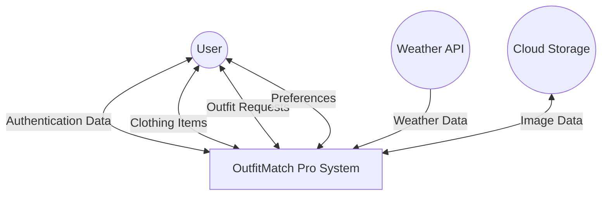
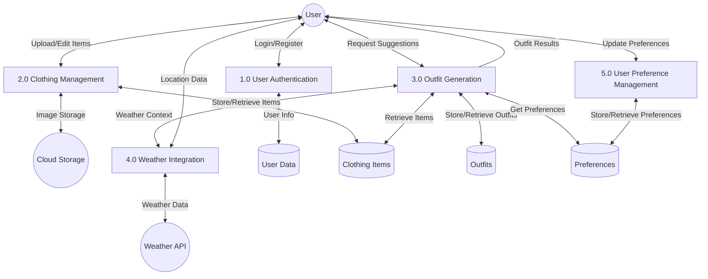
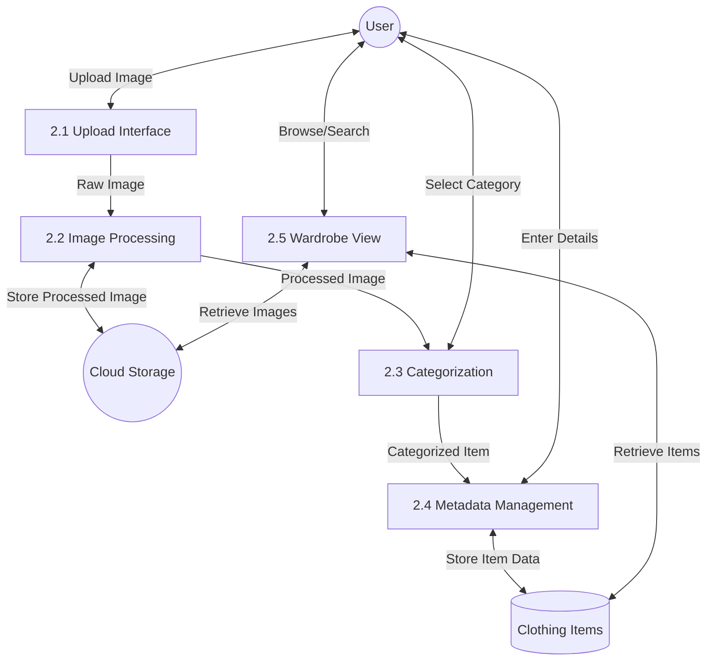
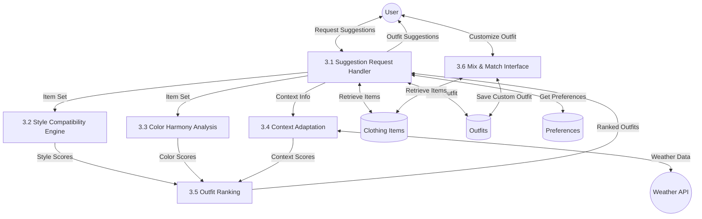

# Data Flow Diagram

## Level 0 DFD (Context Diagram)

```mermaid
flowchart TD
    User((User)) <--> |Authentication Data| OutfitMatchPro[OutfitMatch Pro System]
    User <--> |Clothing Items| OutfitMatchPro
    User <--> |Outfit Requests| OutfitMatchPro
    User <--> |Preferences| OutfitMatchPro
    WeatherAPI((Weather API)) --> |Weather Data| OutfitMatchPro
    CloudStorage((Cloud Storage)) <--> |Image Data| OutfitMatchPro
```

## Level 1 DFD

```mermaid
flowchart TD
    %% External entities
    User((User))
    WeatherAPI((Weather API))
    CloudStorage((Cloud Storage))
    
    %% Processes
    P1[1.0 User Authentication]
    P2[2.0 Clothing Management]
    P3[3.0 Outfit Generation]
    P4[4.0 Weather Integration]
    P5[5.0 User Preference Management]
    
    %% Data stores
    DS1[(User Data)]
    DS2[(Clothing Items)]
    DS3[(Outfits)]
    DS4[(Preferences)]
    
    %% Data flows
    User <--> |Login/Register| P1
    P1 <--> |User Info| DS1
    
    User <--> |Upload/Edit Items| P2
    P2 <--> |Store/Retrieve Items| DS2
    P2 <--> |Image Storage| CloudStorage
    
    User <--> |Request Suggestions| P3
    P3 --> |Outfit Results| User
    P3 <--> |Retrieve Items| DS2
    P3 <--> |Store/Retrieve Outfits| DS3
    P3 <--> |Get Preferences| DS4
    P3 <--> |Weather Context| P4
    
    P4 <--> |Weather Data| WeatherAPI
    User <--> |Location Data| P4
    
    User <--> |Update Preferences| P5
    P5 <--> |Store/Retrieve Preferences| DS4
```

## Level 2 DFD - Clothing Management Process

```mermaid
flowchart TD
    %% External entities
    User((User))
    CloudStorage((Cloud Storage))
    
    %% Processes
    P2.1[2.1 Upload Interface]
    P2.2[2.2 Image Processing]
    P2.3[2.3 Categorization]
    P2.4[2.4 Metadata Management]
    P2.5[2.5 Wardrobe View]
    
    %% Data stores
    DS2[(Clothing Items)]
    
    %% Data flows
    User <--> |Upload Image| P2.1
    P2.1 --> |Raw Image| P2.2
    P2.2 <--> |Store Processed Image| CloudStorage
    P2.2 --> |Processed Image| P2.3
    User <--> |Select Category| P2.3
    P2.3 --> |Categorized Item| P2.4
    User <--> |Enter Details| P2.4
    P2.4 <--> |Store Item Data| DS2
    User <--> |Browse/Search| P2.5
    P2.5 <--> |Retrieve Items| DS2
    P2.5 <--> |Retrieve Images| CloudStorage
```

## Level 2 DFD - Outfit Generation Process

```mermaid
flowchart TD
    %% External entities
    User((User))
    WeatherAPI((Weather API))
    
    %% Processes
    P3.1[3.1 Suggestion Request Handler]
    P3.2[3.2 Style Compatibility Engine]
    P3.3[3.3 Color Harmony Analysis]
    P3.4[3.4 Context Adaptation]
    P3.5[3.5 Outfit Ranking]
    P3.6[3.6 Mix & Match Interface]
    
    %% Data stores
    DS2[(Clothing Items)]
    DS3[(Outfits)]
    DS4[(Preferences)]
    
    %% Data flows
    User <--> |Request Suggestions| P3.1
    P3.1 <--> |Retrieve Items| DS2
    P3.1 <--> |Get Preferences| DS4
    P3.1 --> |Item Set| P3.2
    P3.1 --> |Item Set| P3.3
    P3.1 --> |Context Info| P3.4
    
    P3.2 --> |Style Scores| P3.5
    P3.3 --> |Color Scores| P3.5
    P3.4 <--> |Weather Data| WeatherAPI
    P3.4 --> |Context Scores| P3.5
    
    P3.5 --> |Ranked Outfits| P3.1
    P3.1 --> |Outfit Suggestions| User
    P3.1 <--> |Save Outfit| DS3
    
    User <--> |Customize Outfit| P3.6
    P3.6 <--> |Retrieve Items| DS2
    P3.6 <--> |Save Custom Outfit| DS3
```