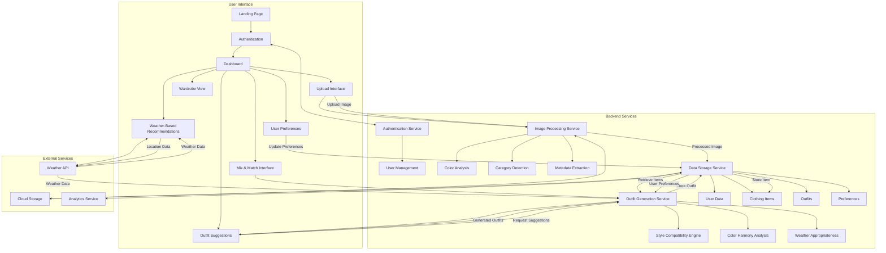
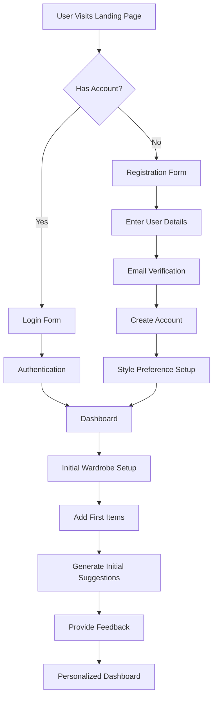
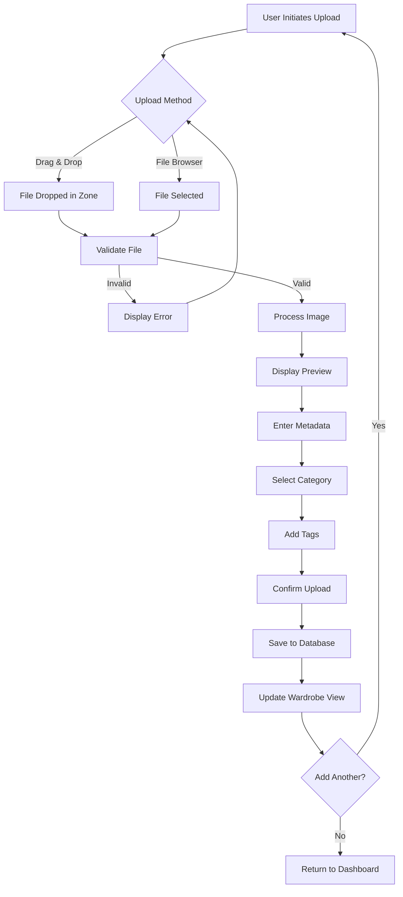
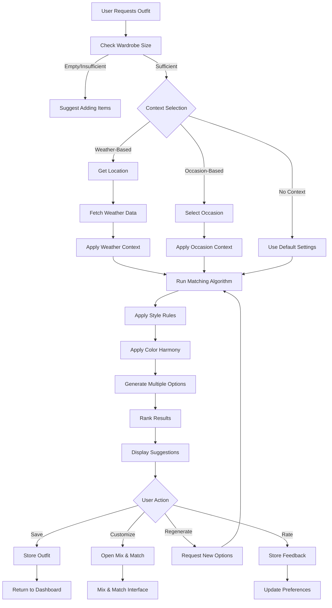
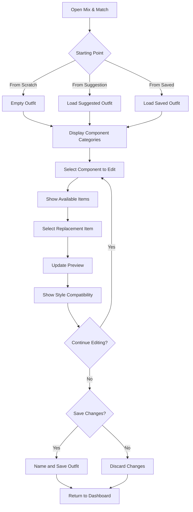
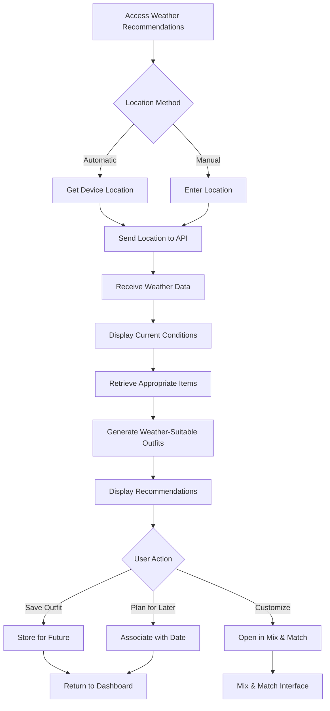
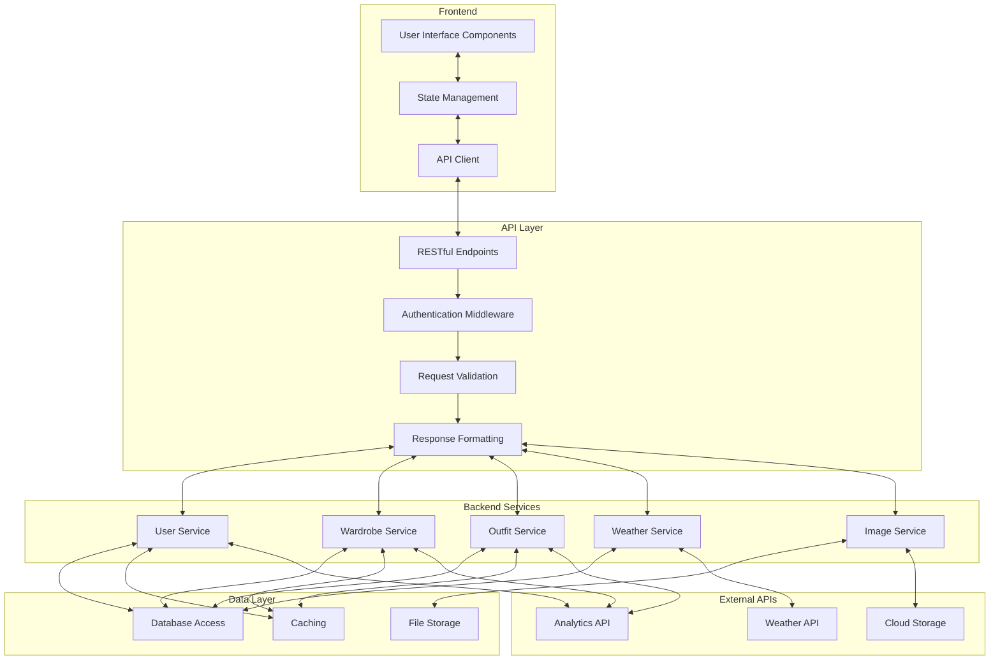
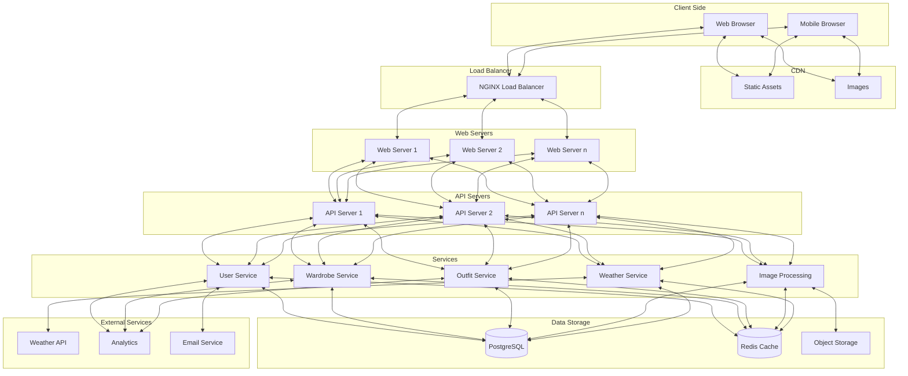

# Workflow of System

## High-Level System Workflow

## User Registration and Onboarding Flow

## Clothing Item Upload Workflow

## Outfit Generation Workflow

## Mix & Match Workflow

## Weather-Based Recommendation Workflow

## Data Flow Between System Components

## System Deployment Architecture

