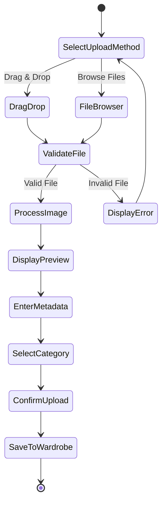
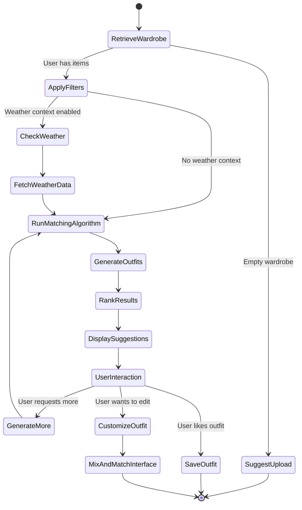
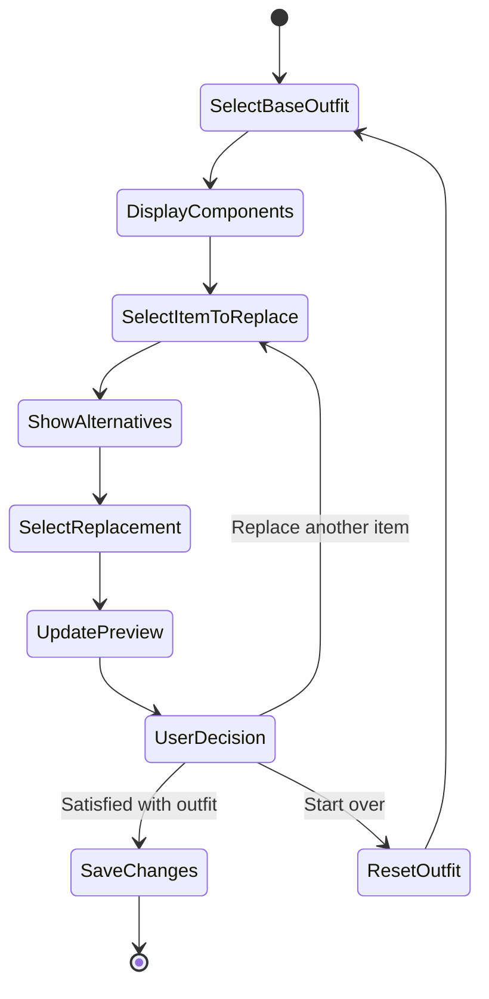
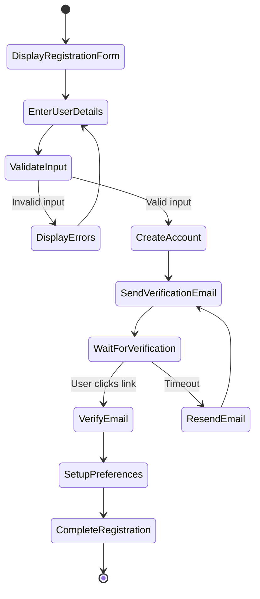

# UML Activity Diagram

## Clothing Item Upload Process

```mermaid
stateDiagram-v2
    [*] --> SelectUploadMethod
    SelectUploadMethod --> DragDrop: Drag & Drop
    SelectUploadMethod --> FileBrowser: Browse Files
    DragDrop --> ValidateFile
    FileBrowser --> ValidateFile
    ValidateFile --> ProcessImage: Valid File
    ValidateFile --> DisplayError: Invalid File
    DisplayError --> SelectUploadMethod
    ProcessImage --> DisplayPreview
    DisplayPreview --> EnterMetadata
    EnterMetadata --> SelectCategory
    SelectCategory --> ConfirmUpload
    ConfirmUpload --> SaveToWardrobe
    SaveToWardrobe --> [*]
```

## Outfit Generation Process

```mermaid
stateDiagram-v2
    [*] --> RetrieveWardrobe
    RetrieveWardrobe --> ApplyFilters: User has items
    RetrieveWardrobe --> SuggestUpload: Empty wardrobe
    SuggestUpload --> [*]
    ApplyFilters --> CheckWeather: Weather context enabled
    ApplyFilters --> RunMatchingAlgorithm: No weather context
    CheckWeather --> FetchWeatherData
    FetchWeatherData --> RunMatchingAlgorithm
    RunMatchingAlgorithm --> GenerateOutfits
    GenerateOutfits --> RankResults
    RankResults --> DisplaySuggestions
    DisplaySuggestions --> UserInteraction
    UserInteraction --> SaveOutfit: User likes outfit
    UserInteraction --> GenerateMore: User requests more
    UserInteraction --> CustomizeOutfit: User wants to edit
    SaveOutfit --> [*]
    GenerateMore --> RunMatchingAlgorithm
    CustomizeOutfit --> MixAndMatchInterface
    MixAndMatchInterface --> [*]
```

## Mix & Match Process

```mermaid
stateDiagram-v2
    [*] --> SelectBaseOutfit
    SelectBaseOutfit --> DisplayComponents
    DisplayComponents --> SelectItemToReplace
    SelectItemToReplace --> ShowAlternatives
    ShowAlternatives --> SelectReplacement
    SelectReplacement --> UpdatePreview
    UpdatePreview --> UserDecision
    UserDecision --> SelectItemToReplace: Replace another item
    UserDecision --> SaveChanges: Satisfied with outfit
    UserDecision --> ResetOutfit: Start over
    SaveChanges --> [*]
    ResetOutfit --> SelectBaseOutfit
```

## User Registration Process

```mermaid
stateDiagram-v2
    [*] --> DisplayRegistrationForm
    DisplayRegistrationForm --> EnterUserDetails
    EnterUserDetails --> ValidateInput
    ValidateInput --> DisplayErrors: Invalid input
    DisplayErrors --> EnterUserDetails
    ValidateInput --> CreateAccount: Valid input
    CreateAccount --> SendVerificationEmail
    SendVerificationEmail --> WaitForVerification
    WaitForVerification --> VerifyEmail: User clicks link
    WaitForVerification --> ResendEmail: Timeout
    ResendEmail --> SendVerificationEmail
    VerifyEmail --> SetupPreferences
    SetupPreferences --> CompleteRegistration
    CompleteRegistration --> [*]
```