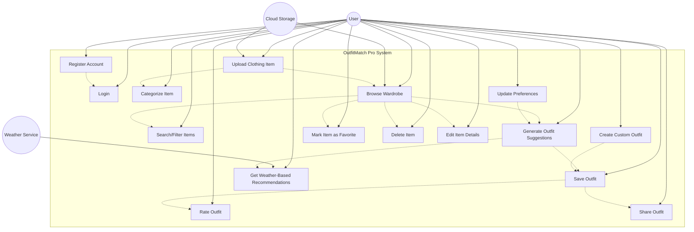

# Use Case Diagram

```mermaid
flowchart TD
    subgraph "OutfitMatch Pro System"
        UC1[Register Account]
        UC2[Login]
        UC3[Upload Clothing Item]
        UC4[Categorize Item]
        UC5[Browse Wardrobe]
        UC6[Search/Filter Items]
        UC7[Generate Outfit Suggestions]
        UC8[Create Custom Outfit]
        UC9[Save Outfit]
        UC10[Rate Outfit]
        UC11[Get Weather-Based Recommendations]
        UC12[Mark Item as Favorite]
        UC13[Delete Item]
        UC14[Edit Item Details]
        UC15[Share Outfit]
        UC16[Update Preferences]
    end

    User((User)) --> UC1
    User --> UC2
    User --> UC3
    User --> UC4
    User --> UC5
    User --> UC6
    User --> UC7
    User --> UC8
    User --> UC9
    User --> UC10
    User --> UC11
    User --> UC12
    User --> UC13
    User --> UC14
    User --> UC15
    User --> UC16

    WeatherService((Weather Service)) --> UC11
    CloudStorage((Cloud Storage)) --> UC3
    CloudStorage --> UC5

    %% Relationships between use cases
    UC1 -.-> UC2
    UC3 -.-> UC4
    UC3 -.-> UC5
    UC5 -.-> UC6
    UC5 -.-> UC7
    UC7 -.-> UC9
    UC8 -.-> UC9
    UC9 -.-> UC10
    UC7 -.-> UC11
    UC5 -.-> UC12
    UC5 -.-> UC13
    UC5 -.-> UC14
    UC9 -.-> UC15
    UC16 -.-> UC7
```