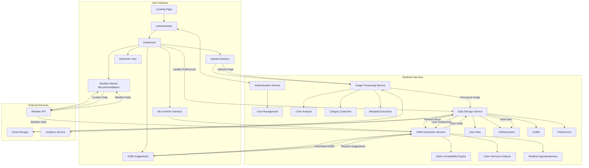

# Workflow of System Diagram

```mermaid
flowchart TD
    subgraph "User Interface"
        A[Landing Page] --> B[Authentication]
        B --> C[Dashboard]
        C --> D[Upload Interface]
        C --> E[Wardrobe View]
        C --> F[Outfit Suggestions]
        C --> G[Mix & Match Interface]
        C --> H[Weather-Based Recommendations]
    end

    subgraph "Backend Services"
        I[Authentication Service] --> J[User Management]
        K[Image Processing Service] --> L[Color Analysis]
        K --> M[Category Detection]
        K --> N[Metadata Extraction]
        O[Outfit Generation Service] --> P[Style Compatibility Engine]
        O --> Q[Color Harmony Analysis]
        O --> R[Weather Appropriateness]
        S[Data Storage Service] --> T[User Data]
        S --> U[Clothing Items]
        S --> V[Outfits]
        S --> W[Preferences]
    end

    subgraph "External Services"
        X[Weather API]
        Y[Cloud Storage]
        Z[Analytics Service]
    end

    %% Connections between sections
    B <--> I
    D --> K
    F --> O
    G --> O
    H <--> X
    K <--> Y
    S <--> Y
    S <--> Z

    %% Data flow for clothing item upload
    D --> |"Upload Image"| K
    K --> |"Processed Image"| S
    S --> |"Store Item"| U

    %% Data flow for outfit generation
    F --> |"Request Suggestions"| O
    S --> |"Retrieve Items"| O
    O --> |"Generated Outfits"| F
    O --> |"Store Outfit"| S

    %% Weather integration
    H --> |"Location Data"| X
    X --> |"Weather Data"| H
    X --> |"Weather Data"| O

    %% User preferences
    C --> |"Update Preferences"| S
    S --> |"User Preferences"| O
```